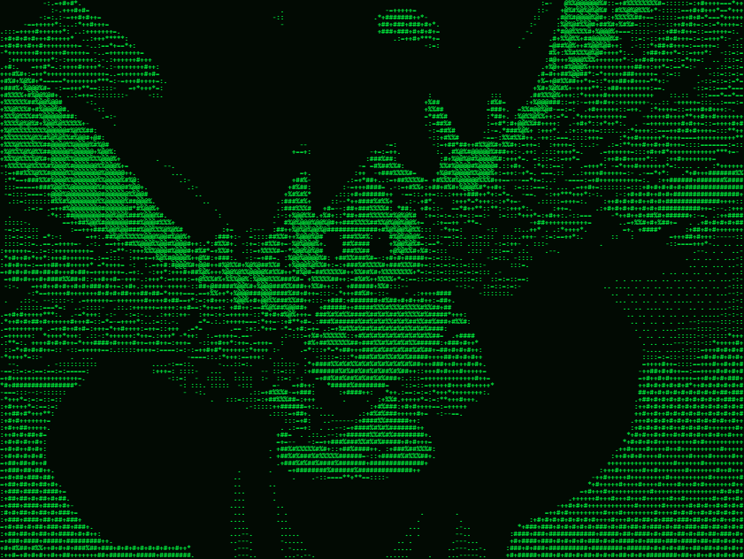

# Edgardo Pinares
`Software Engineer`
 

  

## Stack Tecnológico
`React` • `React Native` • `Python` • `JavaScript` • `HTML5` • `CSS3`
  

---

## 🎨 Proyectos Destacados

### **[ASCII Art Pro](https://epinares.github.io/ascii-art-pro/)** 🚀
Convierte imágenes y GIFs a arte ASCII animado con colores y filtros avanzados.

**Features:**
- 🎬 Decodificador GIF nativo (LZW)
- 🌈 9 paletas de color + personalización
- 🎯 Dithering, Sobel, modo Braille
- 📤 Exporta a PNG, GIF, HTML, Python, TXT
- ⚡ 100% client-side, sin dependencias

**[→ Pruébalo aquí](https://epinares.github.io/ascii-art-pro/)**

---

## 📊 Sobre mí

Desarrollo soluciones frontend interactivas y visuales. Especializado en **JavaScript vanilla** y frameworks como React. Me encanta convertir ideas complejas en código limpio y eficiente.

---

 

&nbsp;&nbsp;&nbsp;

&nbsp;&nbsp;&nbsp;

